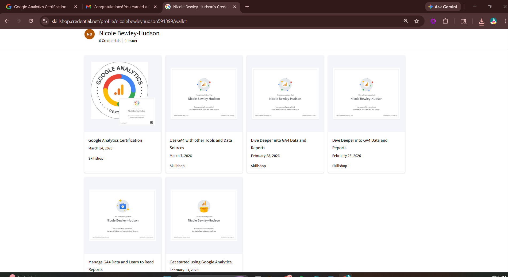
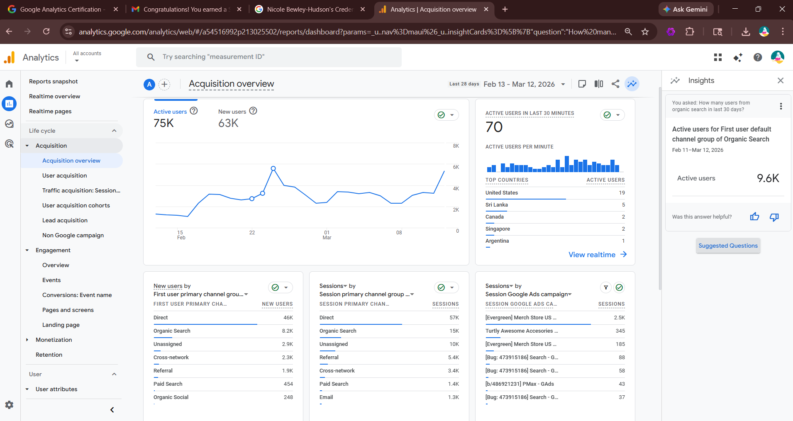
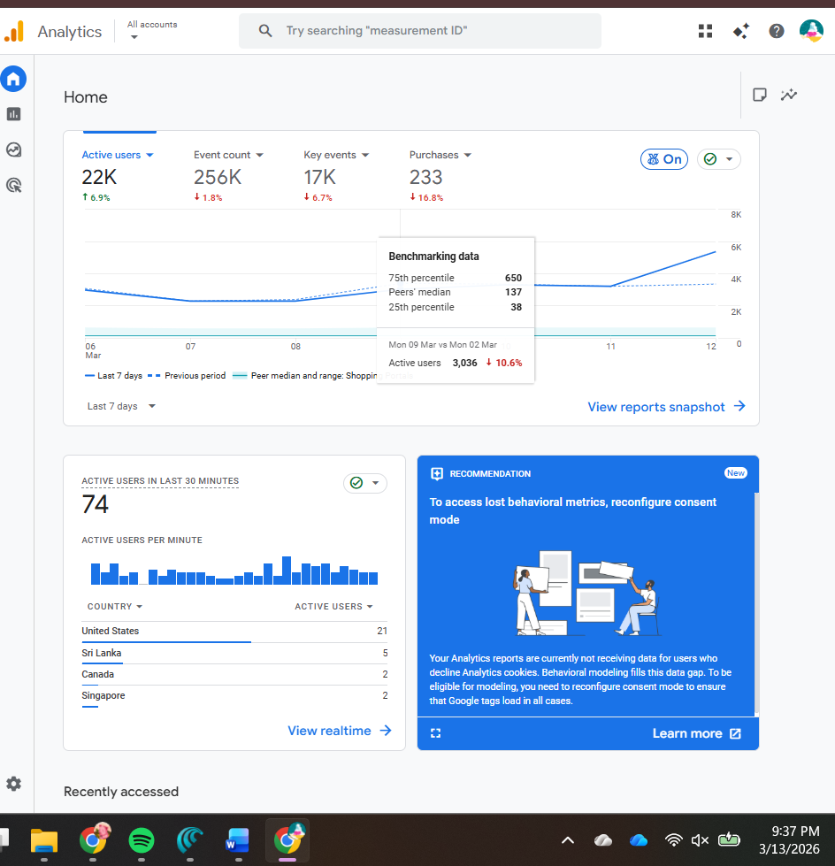

# 1. Proof of Completion
I successfully passed the **Google Analytics 4 Certification** through Skillshop on March 14, 2026.

\

# 2. Exam Reflection

## Results Summary
Pass — Score: \*\*98/100\*\*. I successfully earned the Google Analytics 4 Certification through Skillshop on March 14, 2026.

## Top 3 Topics That Were Most Challenging

- Selecting the most appropriate GA4 exploration or report for a specific analysis objective\
- Interpreting multiple GA4 metrics together such as users, events, and conversions\
- Understanding how user journeys and attribution across channels influence conversion tracking\

## Two Questions I Wish I Could Redo

1. A question related to choosing the best GA4 exploration to analyze user behavior patterns because I second-guessed which exploration type would provide the most meaningful insight.\
2. A question involving interpretation of conversion-related metrics within a report where I needed to determine which data best explained a change in performance.\

## CEP Connection

One change I will make in my CEP measurement and analysis plan is to \*\*clearly define a primary KPI before building reports or explorations\*\*. The GA4 certification exam reinforced that starting with a defined KPI makes it easier to select the correct report and interpret the results in a way that supports the project goal.\

---

# 3. GA4 Readiness Check

## KPI Selection:
Active Users

## Supporting Report
Acquisition Overview Report

The KPI I selected is \*\*Active Users\*\* because it measures how many people are visiting and interacting with the website over a specific time period. The \*\*Acquisition Overview report\*\* helps analyze where users are coming from, including channels such as direct traffic, organic search, referrals, and paid search. This supports the project goal by identifying which traffic sources are driving engagement.

---

## Additional GA4 Dashboard View

The GA4 dashboard below shows key performance metrics including active users, event counts, key events, and purchases. This overview helps provide a quick snapshot of website activity and engagement trends.

